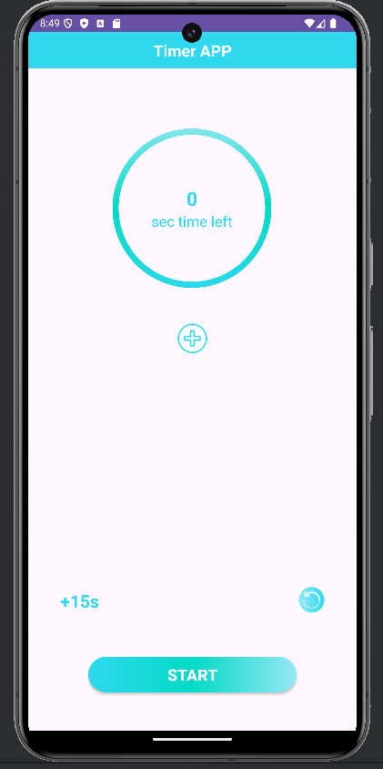
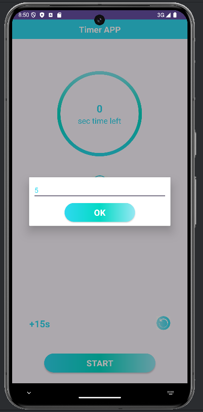
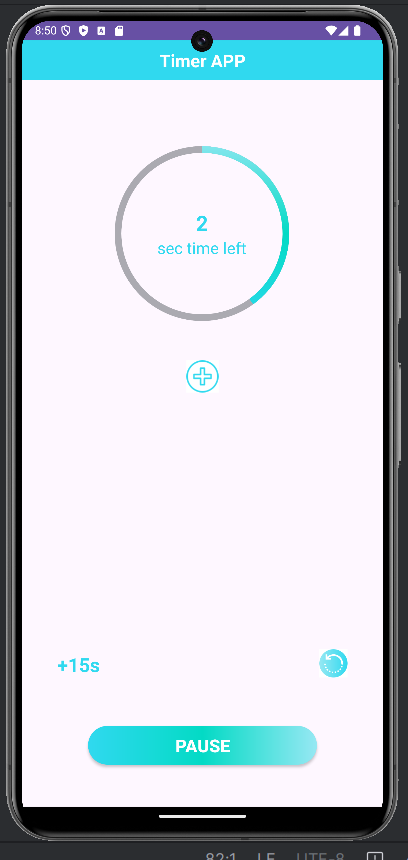
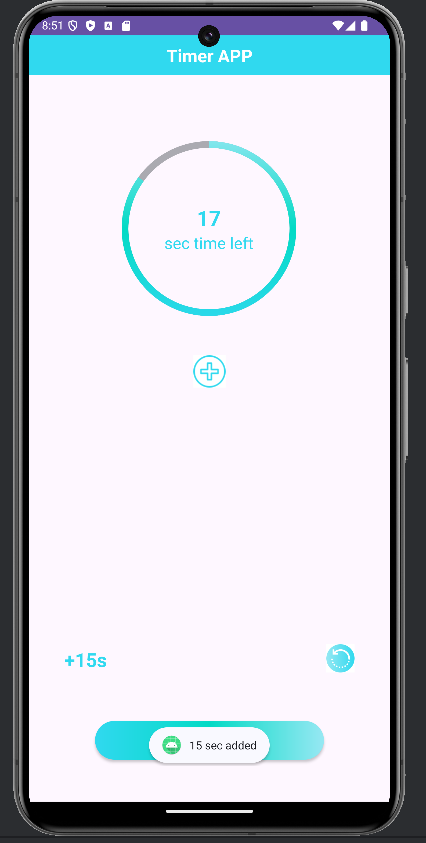
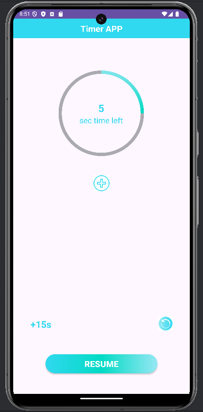
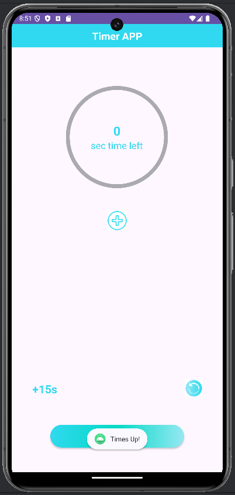

# Timer APP ⏱️
Welcome to the Timer APP ‼️

The Timer app is a simple and intuitive tool for setting countdowns with ease.
Developed using Android Studio in Java, this app allows users to set a timer for any duration and provides visual and auditory alerts when the time is up.
Ideal for cooking, studying, workouts, and time management, the app includes customizable options for sound alerts, quick preset timers, and a pause/resume feature.
With a minimalistic interface and smooth functionality, this app is a convenient and reliable companion for time tracking on the go.
 
 

## Preview

  
  

  
  

  
  

